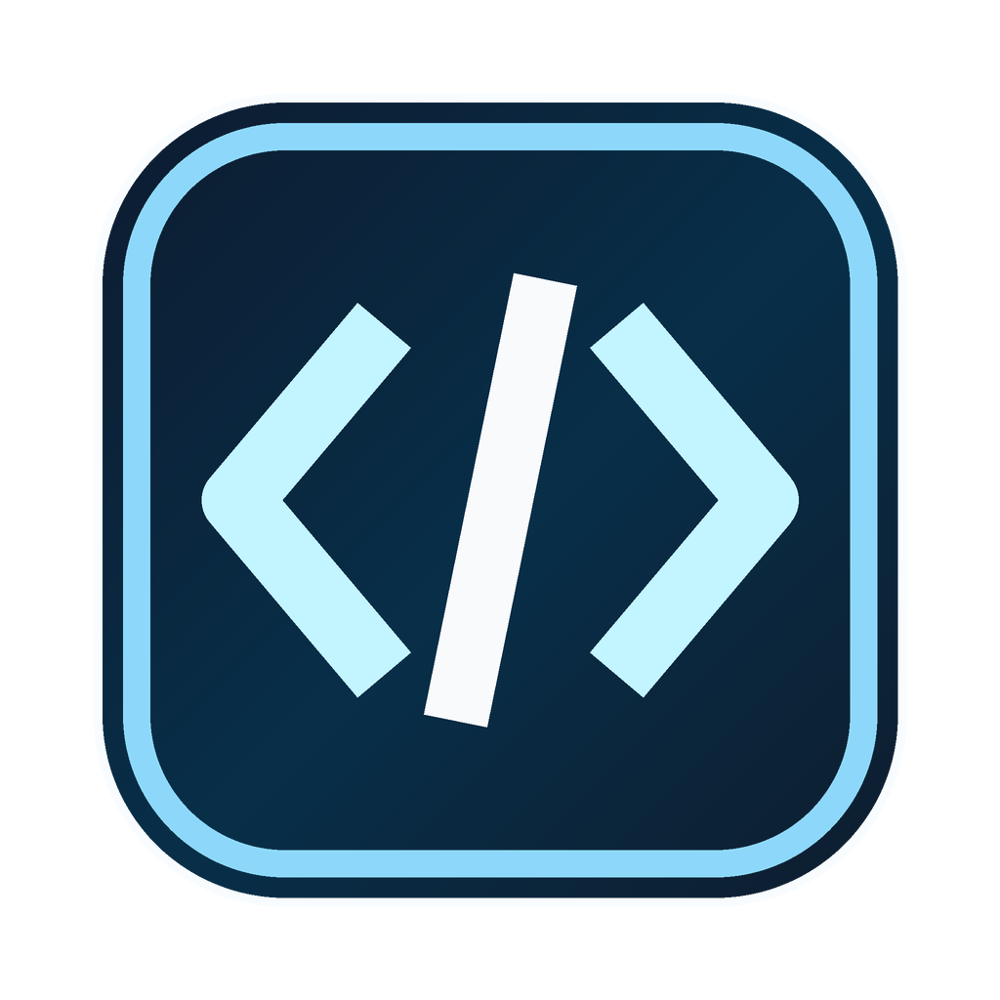
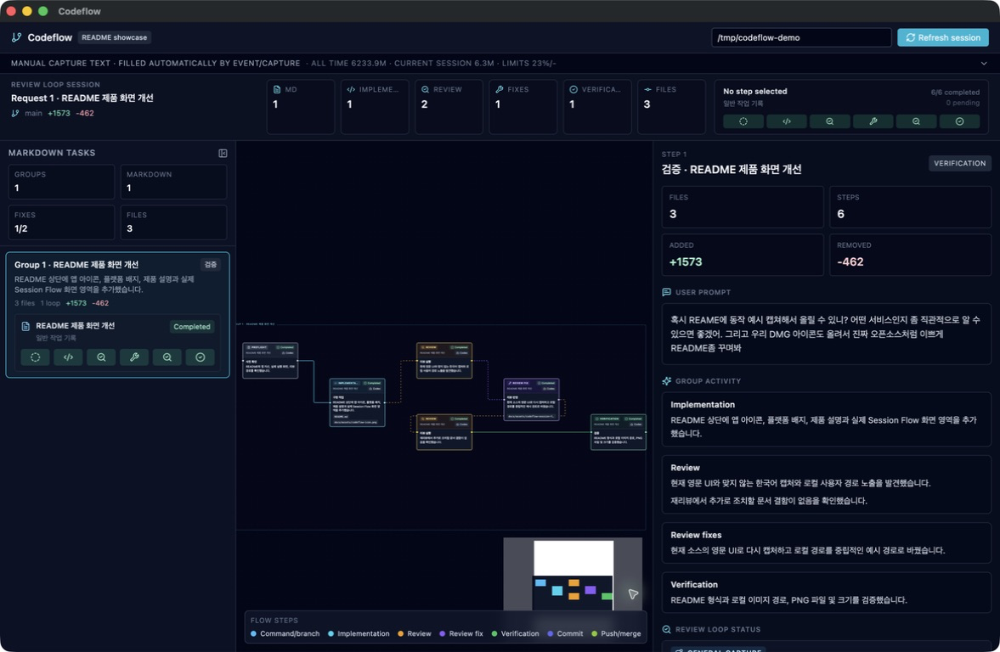
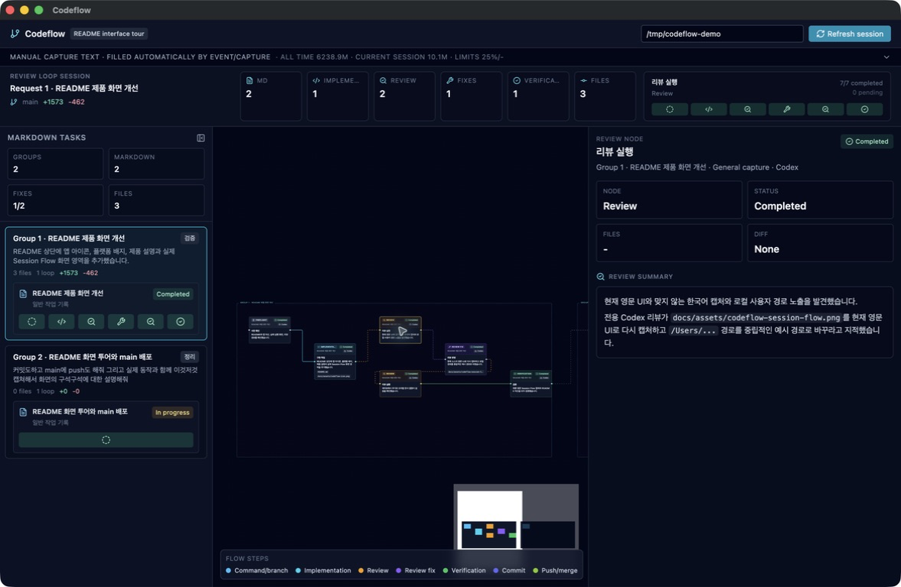
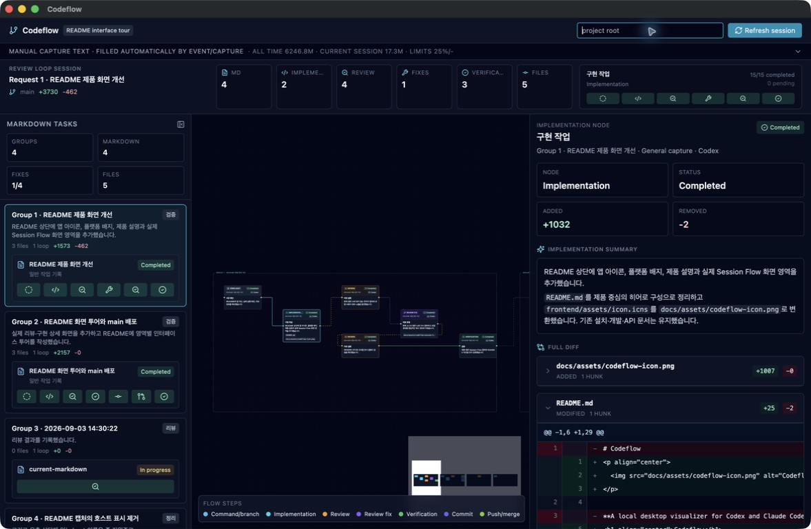

<p align="center">
  
</p>

<h1 align="center">Codeflow</h1>

<p align="center">
  See your coding agent's work—from prompt to verified change.
</p>

<p align="center">
  
  
  
</p>

Codeflow is a local desktop companion for Codex and Claude Code. It turns an
agent task into a clear **Session Flow**: what was requested, what changed,
what review found, and how the work was verified.



Instead of reconstructing an implementation from terminal output and chat
history, open Codeflow to follow the work at a glance. The app runs a local
backend on `127.0.0.1`; the adapter records the workflow without calling an
external LLM API.

Codeflow has two parts:

- **Desktop app**: a packaged Electron app. It starts a local FastAPI backend and receives workflow events on `127.0.0.1:8019`.
- **Codex / Claude Code plugin or Skill**: a thin orchestrator that runs and
  records parallel discovery, implementation, review, review-fix, verification,
  and authorized Git integration.

The plugin does not download or install the desktop app for you. Install it
first. The host can select Codeflow automatically for repository work; invoke
`$codeflow` or `/codeflow:codeflow` explicitly when you need guaranteed
activation. Codeflow itself does not call any external LLM API.

## Interface Tour

The main Session Flow view keeps the task context, workflow, and selected-step
details visible together:

- **Top**: session/project controls and refresh sit above the usage strip;
  counters and the status rail summarize the current run.
- **Left**: task groups and their workflow items let you switch between
  requests.
- **Center**: the workflow graph shows the sequence from command through
  implementation, review, fixes, and verification.
- **Right**: the context panel changes with the selected node, showing the
  prompt, summaries, review status, or file diff.
- **Bottom**: the legend identifies node types, while the minimap and zoom
  controls make larger flows easy to navigate.

### Review details



Select a review node to see its reviewer, completion status, and review summary
without leaving the workflow.

### Change details



Select an implementation or review-fix node to inspect the scoped files and
raw added/removed lines captured for that step.

## Quick Start

Codeflow needs the desktop app, Python 3.10 or newer, and an adapter for Codex
or Claude Code. You do not need to clone this repository.

### 1. Check Python

The capture adapter uses Python's standard library only; no `pip install` is
needed. The packaged desktop app already includes its backend executable.

macOS:

```bash
python3 --version
```

Windows PowerShell (either command is fine):

```powershell
python --version
py -3 --version
```

Install Python 3.10 or newer before continuing if neither command works.

### 2. Install The Desktop App

#### macOS (Apple silicon)

1. [Download the macOS DMG](Codeflow-0.2.1-arm64.dmg?raw=1).
2. Open `Codeflow-0.2.1-arm64.dmg` from your Downloads folder.
3. Drag `Codeflow.app` into `/Applications`.
4. Launch Codeflow once. If macOS blocks it, control-click `Codeflow.app` in
   Finder and choose **Open**.

#### Windows (x64)

1. [Download the Windows portable EXE](Codeflow-0.2.1-x64.exe?raw=1).
2. Move it to a permanent location and register that path in PowerShell:

```powershell
$codeflowDir = "$env:LOCALAPPDATA\Codeflow"
New-Item -ItemType Directory -Force $codeflowDir
Move-Item "$env:USERPROFILE\Downloads\Codeflow-0.2.1-x64.exe" $codeflowDir
setx CODEFLOW_APP_EXECUTABLE "$codeflowDir\Codeflow-0.2.1-x64.exe"
```

3. Open a new terminal so it sees the environment variable, then run the EXE
   once:

```powershell
Start-Process $env:CODEFLOW_APP_EXECUTABLE
```

### 3. Install The Adapter

Choose Codex, Claude Code, or install both.

#### Codex

Paste this into a Codex task:

```text
$skill-installer install https://github.com/JY-1019/codeflow/tree/main/skill as codeflow
```

Start a new Codex task after installation, then invoke `$codeflow` or include
`codeflow` in the request.

#### Claude Code

Run this once in a shell:

```bash
claude plugin marketplace add JY-1019/codeflow --sparse .claude-plugin skills skill bin && claude plugin install codeflow@codeflow
```

Start a new Claude Code session after installation, then invoke
`/codeflow:codeflow` or include `codeflow` in the request.

Because this repository is private, both installers need access to it. Sign in
to GitHub first or provide the Git credentials/token used by Codex or Claude
Code.

### 4. Verify The Setup

Keep the desktop app running, start a new Codex task or Claude Code session, and
send:

```text
Open Codeflow and record this test task.
```

Codeflow should open or focus its window and add the task to **Session Flow**.
For later repository work, the host may select Codeflow from the request's
meaning. Invoke `$codeflow` in Codex or `/codeflow:codeflow` in Claude Code when
automatic Skill routing does not select it.

## Plugin Layout

This repository root is also the plugin root.

- Codex manifest: `.codex-plugin/plugin.json`
- Claude Code manifest: `.claude-plugin/plugin.json`
- Claude Code marketplace: `.claude-plugin/marketplace.json`
- Plugin skill wrapper: `skills/codeflow/SKILL.md`
- Canonical skill instructions: `skill/SKILL.md`
- Plugin PATH wrappers: `bin/codeflow`, `bin/codeflow-capture`

Codeflow is not a background filesystem watcher. Once the host selects the
Skill, the prompt's wording does not change the required workflow.

## Default Workflow

Before editing, Codeflow partitions the request into independent units and runs
read-only discovery in parallel when the host supports it. Non-overlapping
implementation work runs in parallel only inside explicitly authorized Git
worktrees; other writes remain serialized.

Every changed unit must complete this loop:

```text
implementation -> review -> review_fix (if needed) -> review -> verification
```

Review and verification repeat until there are no actionable findings and the
focused checks pass, or the task reaches a genuine blocker.

When Codeflow owns execution policy, implementation workers use a current,
slightly leaner model when the host can select one:

- Codex: latest `terra`, currently `gpt-5.6-terra`, medium effort
- Claude Code: latest `sonnet` alias, currently Claude Sonnet 5 on the Anthropic
  API, medium effort

An explicitly selected, more-specific execution Skill owns its unit, model,
Git, and review policies; Codeflow adds capture, missing orchestration defaults,
and final synthesis without overriding that workflow.

Review uses a dedicated reviewer agent, not the implementation agent asking
itself to review. In Codex, native `/review` (or CLI `codex review`) starts that
dedicated reviewer. In an automatic Claude Code loop, Codeflow runs the
model-callable `codex review --uncommitted` CLI for working-tree changes (or an
explicit `--base`/`--commit` target); `/codex:review --wait` reaches the same
shared reviewer when you invoke it directly, but Skills cannot invoke that
user-only slash command. A generic Codex prompt or `codex exec` does not count.
If the Codex reviewer is unavailable, a separate Claude reviewer context handles
the fallback. Before editing, Codeflow snapshots the unit's planned write paths;
the reviewer is limited to the resulting unit patch and never treats unrelated
pre-existing working-tree changes as findings or fix targets. The actual
reviewer is always recorded.

Codeflow changes Git state only when the user explicitly asks to commit, push,
merge, or reflect work into a branch. New implementation work uses one isolated
branch and worktree per independent unit, then serializes integration and push.
A request that only commits, pushes, or merges an existing named state stays on
that state instead of creating replacement work. Without Git authorization,
Codeflow does not create branches, worktrees, commits, or remote changes.
Conflict resolution, commit hooks, or remote integration that changes files
opens a new integration unit and repeats review and verification before push.
Codeflow opens the session window on the canonical repository, keeps each
worker run on one worktree path, and returns the session to the canonical path
before temporary worktrees are removed.

The coordinator waits for all parallel units and returns one synthesized report
covering the outcome, review fixes, verification, Git result, model fallbacks,
blockers, and remaining risks.

Example: Codex implements and Codex `/review` reviews:

```text
Use codeflow to record this implementation and review loop.
After implementing, run native /review so Codex's dedicated reviewer is the quality gate.
Fix actionable findings, then run native /review again.
Record verification as well. Do not commit or push.
```

Example: Claude Code implements and prefers Codex review:

```text
Use codeflow to implement this change and record the workflow.
Let Codeflow snapshot the implementation unit, then run codex review --uncommitted with review scope limited to that resulting unit patch. Use /codex:review --wait only when invoking review yourself.
Fix review findings, review again, and record verification. Skip commit and push.
```

Longer copy-paste prompts are available in [`prompts/`](prompts/).

## What Gets Recorded

The primary recording unit is a `POST /api/sessions/event` event.

- `preflight`: dependency analysis, reviewer availability, and parallel lanes
- `branch`: an authorized worktree and work branch created successfully
- `implementation`: the implementation step and its diff
- `review`: the review result summary, including no-finding reviews
- `review_fix`: the step that addresses review findings and its diff
- `verification`: focused tests, typechecks, builds, or other checks
- `commit`, `push`, `merge`: optional events recorded only when another workflow performs them

Each step can include an `agent` value.

- Claude Code implementation -> Codex review: `claude-code` -> `codex`
- Codex implementation -> Codex review: `codex` -> `codex`
- Claude Code implementation -> Claude Code review: `claude-code` -> `claude-code`
- Codex implementation -> Claude Code review: `codex` -> `claude-code`

Events with the same `session_id` and `workflow_id` belong to one user request;
each parallel unit uses its own stable `run_id`. Codeflow reuses the host
conversation ID when available and passes that value as `CODEFLOW_SESSION_ID`
across parallel lanes and cross-tool handoffs. The UI shows a small agent badge
on every workflow step, including `branch`, `commit`, `push`, and `merge` events.

## How It Works

```text
user prompt
  -> Codex / Claude Code plugin or Skill
  -> codeflow-capture
  -> installed Codeflow.app / EXE launch or focus
  -> local FastAPI backend
  -> Electron Session Flow UI
```

The capture script prefers the plugin PATH wrapper first, then falls back to
standalone Skill installation paths:

```bash
CAPTURE="$(command -v codeflow-capture || true)"
[ -n "$CAPTURE" ] || CAPTURE="$HOME/.codex/skills/codeflow/scripts/codeflow_capture.py"
[ -f "$CAPTURE" ] || CAPTURE="$HOME/.claude/skills/codeflow/scripts/codeflow_capture.py"
```

The Claude plugin's `codeflow-capture` wrapper selects `python3`, `python`, or
the Windows `py -3` launcher. A standalone Codex Skill invokes its installed
`.py` script with the available Python 3.10+ command. Neither path installs
Python packages or depends on executable bits preserved by a GitHub ZIP.

The launcher prefers the installed packaged app:

- macOS: `/Applications/Codeflow.app/Contents/MacOS/Codeflow`
- Windows: the portable EXE path set in `CODEFLOW_APP_EXECUTABLE`

If the installed app is missing, normal user flows fail clearly. Repository-local Electron fallback is only for development:

```bash
CODEFLOW_ALLOW_DEV_LAUNCH=1 ./skill/bin/codeflow --project-root "$PWD"
```

## UI

The main screen is **Session Flow**. It lays out request groups from left to right and expands Markdown Branch workflows into:

```text
Markdown command -> implementation -> review -> review_fix -> verification -> optional commit/push/merge
```

Files are shown in the right-side detail panel, not as primary graph nodes. Click an implementation or review-fix node to inspect raw added/deleted lines. Click a review node to inspect the review summary.

## Development

Backend:

```bash
cd backend
python3 -m venv venv && source venv/bin/activate
pip install -e .
python main.py
```

Frontend:

```bash
cd frontend
npm install
npm run dev
```

Build a macOS DMG:

```bash
cd frontend
npm run dist:mac
```

The DMG is written to `frontend/release/Codeflow-<version>-<arch>.dmg`. Release
copies stored in the repository root must be tracked with Git LFS.

Build a Windows portable EXE from a Windows environment:

```bash
cd frontend
npm run dist:win
```

The EXE is written to `frontend/release/Codeflow-<version>-x64.exe`.

## API

### `POST /api/sessions/event`

```json
{
  "project_root": "/path/to/repo",
  "source": "branch",
  "session_id": "optional-stable-session-id",
  "workflow_id": "stable-id-for-this-user-command",
  "run_id": "stable-id-for-one-unit",
  "skill": "general",
  "command_label": "Documentation cleanup",
  "step_kind": "implementation",
  "agent": "claude-code",
  "step_summary": "Updated README installation flow.",
  "step_detail": "Separated DMG installation, plugin setup, and invocation examples.",
  "step_status": "completed"
}
```

Supported `step_kind` values:

```text
preflight, markdown, branch, implementation, review, review_fix, verification, commit, push, merge
```

### `POST /api/sessions/capture`

Legacy final-response fallback. New review-loop integrations should use `/api/sessions/event`.

### `POST /api/changes`

Low-level diff analysis API. Supported `source` values are `working`, `staged`, `range`, and `branch`.

## Repository Layout

```text
codeflow/
├── .codex-plugin/plugin.json      # Codex plugin manifest
├── .claude-plugin/                # Claude Code manifest + marketplace
├── bin/                           # plugin PATH wrappers
├── backend/                       # FastAPI, no external LLM calls
├── frontend/                      # Electron + Vite + React + @xyflow/react
├── prompts/                       # portable prompt examples
├── skill/                         # canonical Skill instructions + launcher
└── skills/codeflow/               # plugin Skill wrapper
```

## Validation

```bash
pytest -q backend/tests
```

```bash
cd frontend
npm run typecheck
npm run build
```

```bash
python3 ~/.codex/skills/.system/plugin-creator/scripts/validate_plugin.py "$PWD"
claude plugin validate .
```
